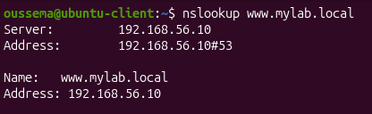
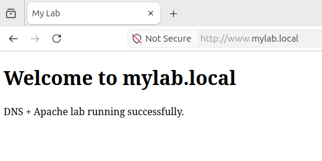
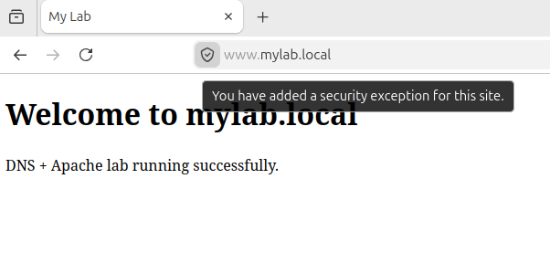
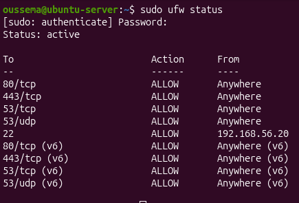
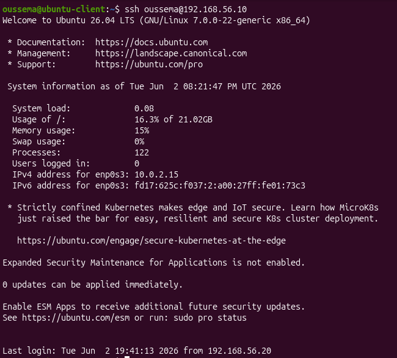

# DNS & HTTPS Web Server Lab

A local DNS and web server lab built from scratch on Ubuntu VMs using VirtualBox.

## Architecture

| Component | Details |
|-----------|---------|
| Server VM | Ubuntu Server 26.04 LTS |
| Client VM | Ubuntu Desktop 26.04 LTS |
| Network | VirtualBox Internal Network |
| Server IP | 192.168.56.10 |
| Client IP | 192.168.56.20 |
| Domain | mylab.local |

## What I Built

- **BIND9 DNS Server** — resolves mylab.local with custom zone file, forwards unknown domains to Google DNS
- **Apache2 Web Server** — serves a website accessible via domain name
- **HTTPS** — self-signed SSL certificate encrypting all traffic
- **UFW Firewall** — allows only SSH, HTTP, HTTPS, and DNS traffic
- **SSH Key-based Auth** — passwordless remote access from client to server
- **Auto-start** — all services survive reboots automatically

## Skills Learned

- Linux server administration
- DNS configuration with BIND9
- Apache VirtualHost configuration
- SSL/TLS certificate generation
- Firewall management with UFW
- SSH hardening
- Reading and analyzing server logs
- Netplan network configuration

## Tools Used

- Ubuntu Server & Desktop 26.04 LTS
- BIND9
- Apache2
- OpenSSL
- UFW
- OpenSSH

## Screenshots

### DNS Resolution

### Website over HTTP

### Website over HTTPS

### Firewall Rules

### SSH Connection

